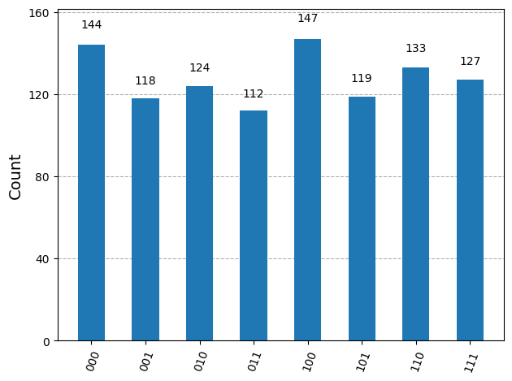

# Quantum Random Number Generator + Secure Key Demo

This repository demonstrates quantum computing basics for randomness and security using Qiskit.

## Project Components
- **QRNG (qrng.ipynb)**: Generates true random bits via quantum superposition and measurement. Includes visualization of uniform distribution.
- **BB84 Simulation (bb84_simulation.ipynb)**: Simulates quantum key distribution, with optional eavesdropper to show error detection.

## Setup and Run
1. Clone repo: `git clone https://github.com/austinpaluch/quantum-rng-secure-comm.git`
2. Install dependencies: `pip install -r requirements.txt`
3. Run notebooks in Jupyter: `jupyter notebook`

## Tech Stack
- Python 3
- Qiskit (quantum circuits)
- Aer Simulator (backend)
- Matplotlib/Numpy (viz/data)

## What I Learned
- Quantum uncertainty for true RNG vs. classical pseudo-random.
- BB84 protocol for secure comm, highlighting basis choice and eavesdropping detection.

## Screenshots

License: MIT